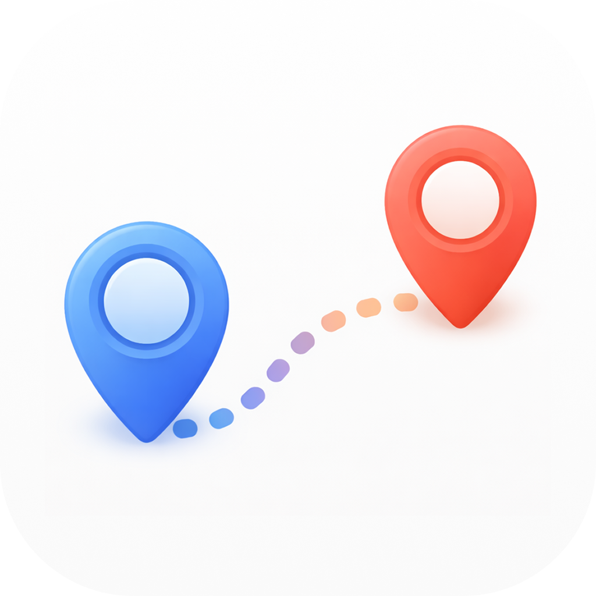
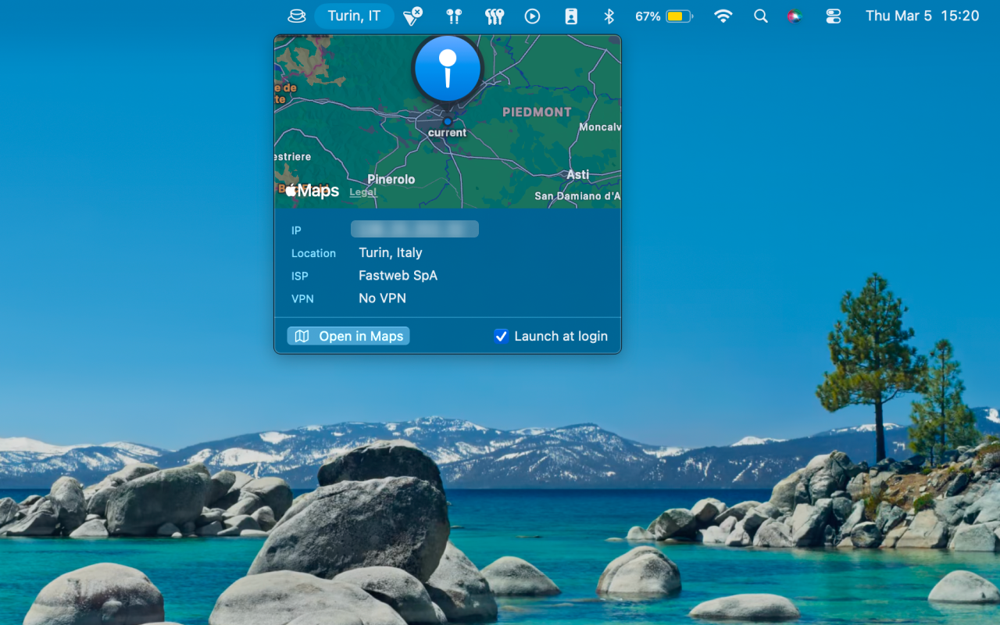
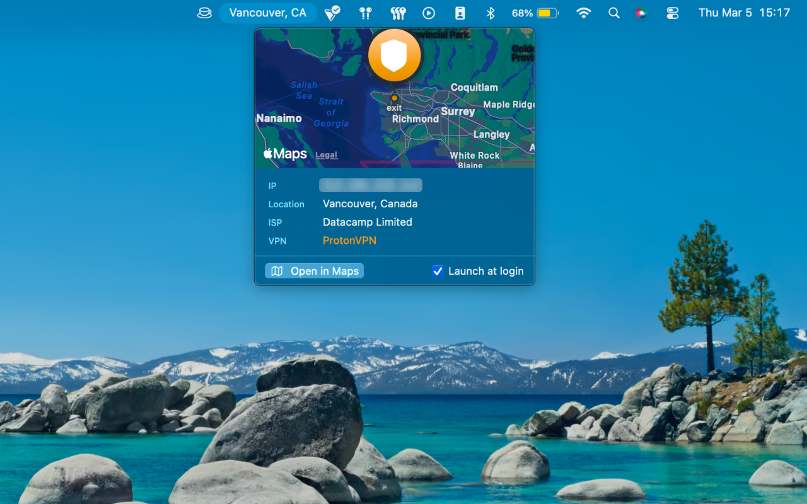

<div align="center">
  
  <h1>Whereabouts</h1>
</div>

<p align="center">
  <a href="https://github.com/zekevh/whereabouts/releases/latest"></a>
  
  
  
</p>

Know where your connection is. Always.

<p align="center">
  
  
</p>

## Install

```sh
brew install --cask zekevh/tap/whereabouts
```

Or [download the DMG](https://github.com/zekevh/whereabouts/releases/latest).

## Features

- Public IP address visible in the menu bar at a glance
- Geolocation: city, region, country, and ISP
- VPN detection — provider name shown when active
- Map view with arc drawn when VPN exit differs from your location
- Copy any value with a single click
- Native Swift — no Electron, no background processes
- Universal binary: Apple Silicon + Intel

## You may also like

- [Moka](https://github.com/zekevh/moka) — caffeinate with control
- [Crest](https://github.com/zekevh/crest) — your watchlist in the menu bar

## License

MIT © [Zeke V. Holt](https://zvh.io)
